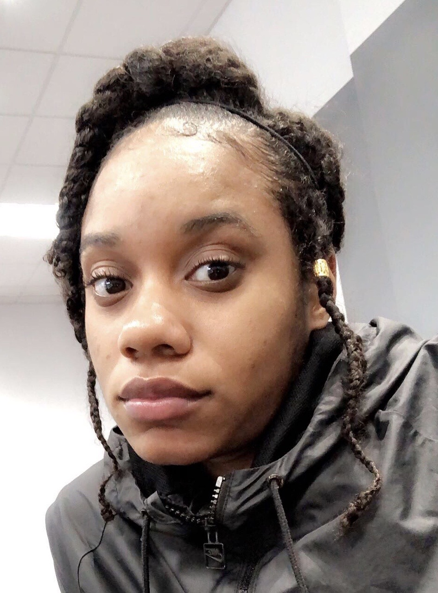
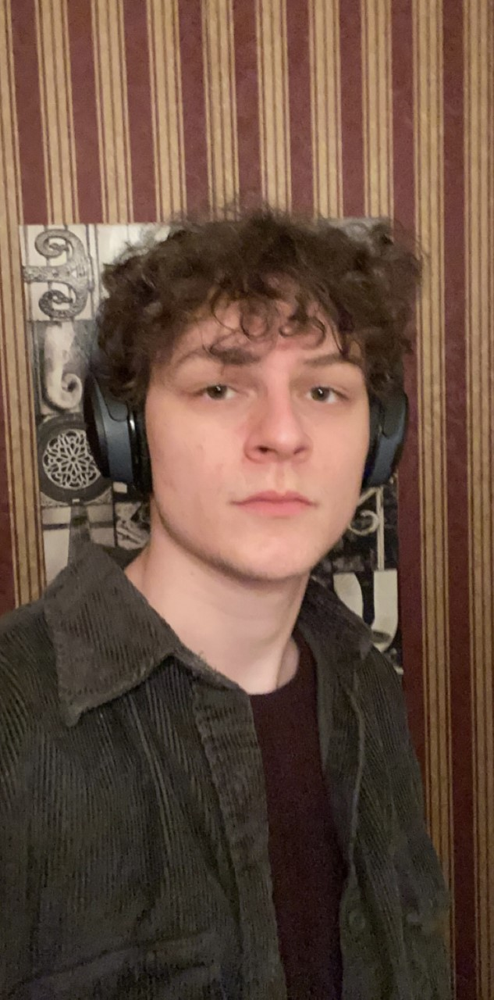

# SP2 Data Mining and AI Audio Agression Detection

## Links

Category | Link
-------- | ----
Project Report | <a href="./M2-DraftFinalProjectReport.docx.pdf">Project Report</a> 
Prototype | <a href="https://onedrive.live.com/view.aspx?resid=E2A1EA8B73197058!15069&ithint=file%2cpptx&authkey=!AJ7EVjwRgSj1Uro">Prototype Slides</a>
Video Demo | <a href="https://youtu.be/9Amha6ldZOI">Link to Video</a>

## Overview
<body>
  Abusive/toxic relationships are the root of many problems our society faces today. Whether it’s physical, emotional, mental, or verbal, we have a responsibility to our communities and society at large to protect ourselves and others from unhealthy relationships. Integrating research-backed indicators of abuse and technology is a popular and growing subset of artificial intelligence and machine learning. The team will create a web scraper to mine videos of conversations from youtube. A tool will be created in python to listen to the conversations and mark if the audio has indicators of verbal abuse or aggression. The results will be stored in a database on AWS for pattern analysis.
The goal of this project is to develop a tool that can help us detect when we or someone else is being aggressive in order to recognize and improve on toxic relationships.
</body>

## Project Members

<table>
  <tr>
    <th>Name</th>
    <th>Role</th>
  </tr>
  <tr>
    <td>Joyre Bohanon</td>
    <td>Team Lead</td>
  </tr>
  <tr>
    <td>Quinn Clark</td>
    <td>Documentation/Test Engineer</td>
  </tr>
  <tr>
    <td>Nicholas Fulton</td>
    <td>Software Developer/Engineer</td>
  </tr>
  <tr>
    <td>Edward Hachem</td>
    <td>Software Developer/Engineer</td>
  </tr>
</table>

## Course Information
<a href="https://www.kennesaw.edu/">Link to Kennesaaw State University</a>  
<a href="https://ccse.kennesaw.edu/cs/index.php">Link to KSU CS Department</a>  

## Member Photos
<table>
  <tr>
    <td>Joyre Bohanon</td>
    <td></td>
    <td>Quinn Clark</td>
    <td></td>
  </tr>
  <tr>
    <td>Nicholas Fulton</td>
    <td></td>
    <td>Edward Hachem</td>
    <td></td>
  </tr>
</table>

